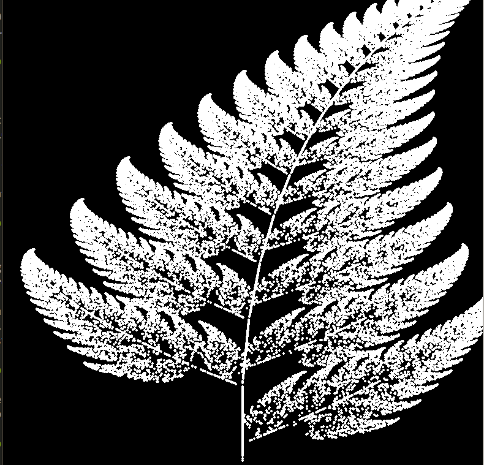

# oFernGenerator

Playing with maths, Barnley fern fractals and ocaml.

  

# references

This project is inspired by Daniel Schiffman video : [**Coding Challenge #108: Barnsley Fern**](https://youtu.be/JFugGF1URNo)

All numerical values and coefficients used to compute geometric transformation come from [**Wikipédia**](https://en.wikipedia.org/wiki/Barnsley_fern)
